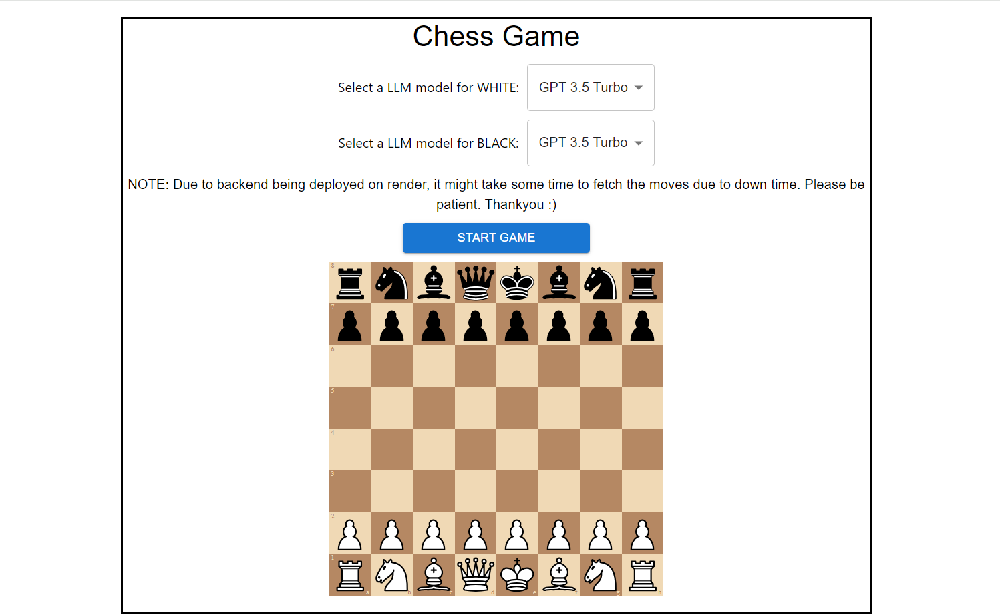

# Chess Game Frontend

This is the frontend for a chess game application. It provides the user interface for automatic chess play between multiple LLM models.

## Technologies Used

- React.js
- Chessboard.jsx
- Material-UI

## Installation

1. Clone the repository: `git clone https://github.com/VKspyder2003/chess-frontend.git`
2. Install dependencies: `npm install`
4. Start the development server: `npm start`

## Features

- Support for multiple LLM models

## Deployment
- This project is deployed on vercel.
- Live Deployment : `https://chess-frontend-pi.vercel.app/`
