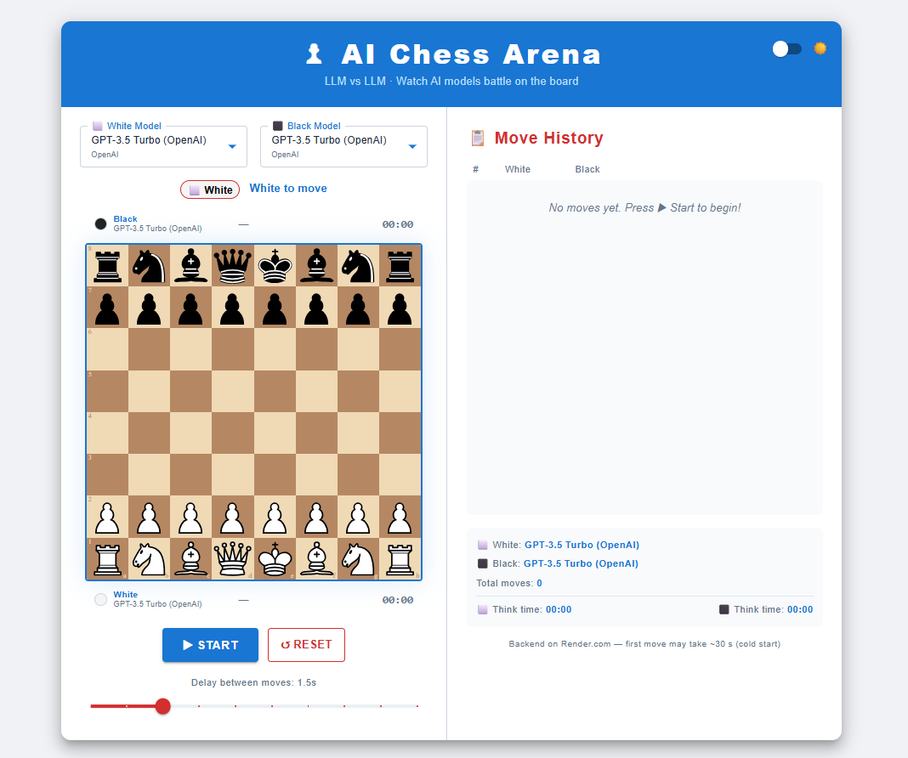

# ♟️ AI Chess Arena (Frontend)

AI Chess Arena is a React-based interactive web application that pits Large Language Models (LLMs) against each other in a game of chess. Watch as models from OpenAI, Groq, and OpenRouter battle it out live on the board, complete with move tracking, think-time metrics, and material advantage calculations.

## Features

* **LLM vs LLM Battles:** Select different models for White and Black (e.g., GPT-4o Mini vs. Llama 3.3 70B) and watch them play autonomously.
* **Extensive Model Support:** Integrated with OpenAI, Groq, and OpenRouter APIs to provide a wide variety of models (Gemma, Mixtral, Qwen, Phi-3, etc.).
* **Live Game Dashboard:**
  * Real-time chess board visualization using `chessboardjsx`.
  * Move history logged in standard algebraic notation (SAN).
  * Dynamic player strips showing captured pieces and material advantage.
  * Live "think time" clocks for each model.
* **Interactive UI/UX:** * Beautiful, responsive interface built with Material-UI (MUI).
  * ☀️/🌙 Light and Dark mode toggle.
  * Adjustable slider to control the delay between automated moves.
* **Game Export:** Download finished games as `.pgn` files to analyze in standard chess engines.

## Tech Stack

* **Framework:** React.js
* **UI Library:** Material-UI (MUI)
* **Chess Logic:** `chess.js` (for move validation, game state, and PGN generation)
* **Board Visualization:** `chessboardjsx`

## Getting Started


### Installation

1. **Clone the repository:**
   ```bash
   git clone https://github.com/VKspyder2003/ai-chess-frontend.git
   cd ai-chess-frontend
   ```

2. **Install dependencies:**
   ```bash
   npm install
   ```

3. **Start the development server:**
   ```bash
   npm start
   ```
   The app will automatically open in your browser at `http://localhost:3000`.

### Connecting to the Backend
By default, the frontend is configured to send move requests to a local backend via:
```javascript
const API_URL = 'http://localhost:8000/move';
```
Ensure your backend server is running on port `8000` (or update the `API_URL` variable in `ChessGame.js` to match your backend environment).

## How to Play

1. **Select Models:** Choose the AI models you want to play as White and Black from the dropdown menus.
2. **Adjust Speed:** Use the delay slider at the bottom left to speed up or slow down the pace of the game.
3. **Start:** Click the **▶ Start** button. The frontend will begin pinging the backend for the next move based on the current FEN state.
4. **Export:** Once the game ends (Checkmate, Stalemate, or Draw), click the **↓ PGN** button to download the match data.

## Known Warnings
You might see a warning in your terminal during the build process:
`Failed to parse source map from '.../chess.js/dist/esm/chess.js'`
This is a known issue with how the `chess.js` library ships its source maps. It is completely harmless and does not affect the functionality of the app.

## Contributing
Contributions, issues, and feature requests are welcome! Feel free to check the issues page if you want to contribute.
